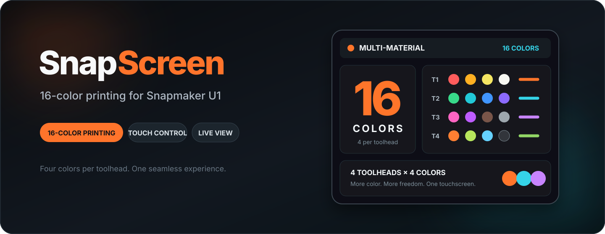
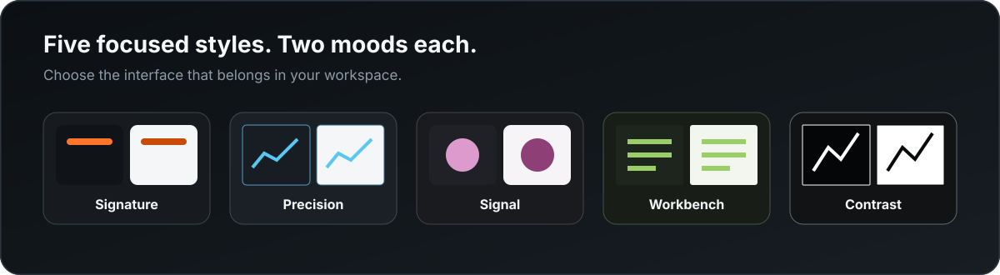

# SnapScreen

  

**SnapScreen is a dedicated touchscreen experience for Snapmaker U1.** It brings the information and controls that matter into one clear, responsive interface — right where the print is happening.

Built for everyday use, SnapScreen helps you move from setup to first layer, live monitoring and final result without constantly returning to a computer.

## Start Here

[Download the latest release](https://github.com/AlphaStudioDE/SnapScreen/releases/latest) | [See all releases](https://github.com/AlphaStudioDE/SnapScreen/releases) | [Report a problem](https://github.com/AlphaStudioDE/SnapScreen/issues) | [Support development](https://buymeacoffee.com/damianborkh)

## The Printer Experience, Reimagined

| | |
| --- | --- |
| **Everything at a glance** Follow temperatures, progress, remaining time, active tools and the state of the current print from one focused dashboard. | **Control that feels immediate** Move, heat, extrude, tune and manage everyday printer actions through a touch-first layout made for the workshop. |
| **See the job before it starts** Browse printer files, inspect thumbnails and explore detailed 2D and 3D print previews before committing to a job. | **Stay close without standing still** Use the live camera view to keep the build area visible, with comfortable touch controls for framing and fullscreen viewing. |
| **Calibration made visual** Turn bed data into an easy-to-read visual map and keep frequently used tools within reach. | **Make it yours** Arrange the dashboard around the way you print and choose an appearance that fits your machine and workspace. |

## Built Around The Whole Print

SnapScreen is designed as a single home for the complete printing workflow:

- prepare the printer and material;
- browse, preview and select a job;
- watch temperatures and progress in real time;
- pause, resume, tune or stop when needed;
- check the camera, calibration views and print information;
- keep favorite actions close with dashboard widgets and macros;
- update to new SnapScreen releases directly from the device.

The result is a control panel that feels like part of the printer — not an accessory sitting beside it.

## An Interface With Character

SnapScreen includes five focused appearance styles: **Signature, Precision, Signal, Workbench and Contrast**. Every style is available in both Light and Dark mode, so the interface can match the room, the printer and the way you prefer to work.

  

Your appearance choice stays separate from dashboard layout and printer settings, making it easy to change the mood without changing the workflow.

## Multi-Material Is The Next Chapter

SnapScreen's multi-material experience is being developed around **CFS Nano**. Early live workflows are now running on real hardware, while broader day-to-day validation continues.

This part of the project is still a **development preview** and should not yet be treated as production-ready. Public updates will focus on the experience and visible capabilities; implementation details remain private.

## Two Sizes, One Experience

| SnapScreen Standard | SnapScreen XL |
| --- | --- |
| The compact original, designed for a clean and practical printer-side installation. | A larger-format edition for users who want more screen space and a roomier view. |

Both variants share the same product direction, familiar workflow and release channel. Always select the release intended for your SnapScreen model.

## Current Project Status

| Experience | Status |
| --- | --- |
| Core printer control and live monitoring | Working on physical hardware |
| Files, thumbnails and print previews | Working |
| Camera, calibration and advanced print tools | Working |
| Standard and XL editions | Available and actively tested |
| Light and Dark appearance collection | Available |
| CFS Nano multi-material experience | Development preview; real-hardware validation in progress |

SnapScreen is under active development. Release notes describe visible changes, compatibility and known limitations for each published version.

## Feedback Shapes The Product

Real-world use is the most valuable test. If something does not look or behave as expected, open a [GitHub issue](https://github.com/AlphaStudioDE/SnapScreen/issues) and include:

- your SnapScreen model and installed version;
- a short description of what happened;
- the steps needed to reproduce it;
- a photo or screenshot when the problem is visual.

Please never publish passwords, Wi-Fi credentials, activation information or other private data in an issue.

## Independent Project

SnapScreen is an independent community project created for Snapmaker U1 owners. It is not affiliated with or endorsed by Snapmaker. Product and company names may be trademarks of their respective owners.

Copyright (c) 2026 Damian Borkowski. All rights reserved.

This repository is the official public information, firmware distribution and update channel for SnapScreen. Unless explicitly stated otherwise, its contents may not be copied, modified or redistributed. Access to downloadable firmware does not grant a license to the firmware or its implementation.

## Support Development

If SnapScreen makes your printing workflow better, you can support continued product development, physical testing and documentation:

- **Buy Me a Coffee:** [Support Damian's projects](https://buymeacoffee.com/damianborkh)
- **PayPal:** `damianborkowski88@gmail.com`

Support is voluntary. It is not a purchase of an activation key or license and does not change the project's access or licensing conditions. Testing, useful feedback and sharing the project are equally welcome.
